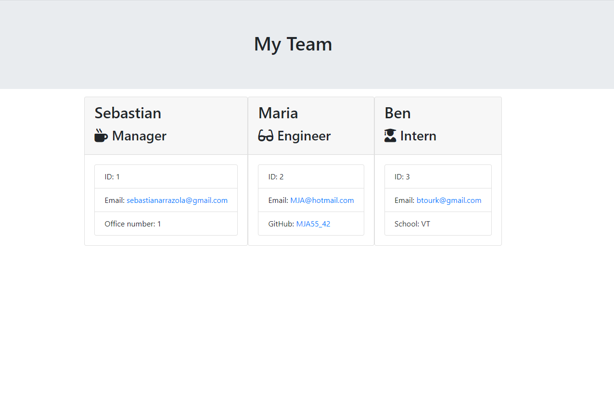

# Unit 10 OOP Homework: Template Engine - Employee Summary

## Description

This application uses Node coupled with CLI to gather user provided information about employees for an engineering team and generates an HTML webpage that displays summaries for each employee.

## Table of Contents

* [Installation](#installation) 
* [License](#license) 
* [Contributors](#contributing) 
* [Tests](#tests) 

## Installation

This application uses Jest to test code and Inquierer to prompt user to gather data. Simply run the following to gather dependencies:
> npm i

To initiate your application, you will need to enter the following command:
> node app.js

## License

## Contributing

none

## Tests

To execute tests the user must execute the following command:
> npm run test

## Input

## Output

## Revision History
template-engine_v1.0 - added .gitignore file keep node modules and .DS_Store files out of git repo.

template-engine_v1.1 - Added README.md, and refactored Employee.js to comply with Employee.test.js.

template-engine_v1.2 - Added all supporting files, and refactored Manager.js to comply with Manager.test.js.

template-engine_v1.3 - Refactored Engineer.js to comply with Engineer.test.js.

template-engine_v1.4 - Refactored Intern.js to comply with Intern.test.js.

template-engine_v1.5 - Added questions array to app.js; Also added injuirer prompting to view current question configurations.

template-engine_v1.6 - Fixed bugs with inqirer answers data handling. New employee objects are now created based on role and passed to htmlRender.js.  

template-engine_v1.7 - Added functionality that stores output file team.html to an output folder in the same directory.

template-engine_v1.8 - Added functionality that recoursivly calls function userPrompt() if user has not yet finished building engineering team. Also added when condisions to the inquirer questions array, to display the intended question for each type of employee.

- - -
© 2019 Trilogy Education Services, a 2U, Inc. brand. All Rights Reserved.
